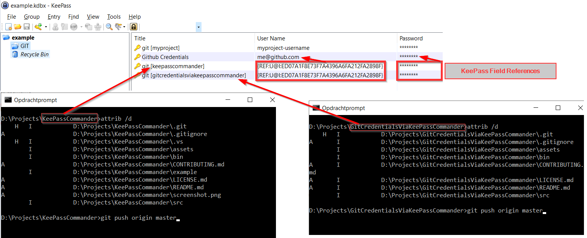

# Git Credentials via KeePassCommander
It's purpose is to retrieve username/password credentials for GIT from [KeePass password store](https://keepass.info/ "KeePass") using plugin [KeePassCommander](https://github.com/MircoBabin/KeePassCommander "KeePassCommander").

# Download binary
For Windows (.NET framework 4), [the latest version can be found here](https://github.com/MircoBabin/GitCredentialsViaKeePassCommander/releases/latest "Lastest Version").

Download the zip and unpack it in the KeePassCommander directory where KeePassCommandDll.dll is located.

The minimum .NET framework required is 4.0.

# Help

Execute **git-credential-keepasscommand.exe** without parameters to view the help.

```
git-credential-keepasscommand 1.0
https://github.com/MircoBabin/GitCredentialsViaKeePassCommander - MIT license

git-credential-keepasscommand.exe is a credential helper for GIT.
It's purpose is to retrieve username/password credentials for GIT from KeePass using plugin KeePassCommander.

INSTALLATION:
*** Place executable and config in same directory as KeePassCommandDll.dll
*** See KeePassCommander at https://github.com/MircoBabin/KeePassCommander
git config --global credential.helper "D:/Projects/GitCredentialsViaKeePassCommander/bin/Release/git-credential-keepasscommand.exe"
git config --system --list --show-origin
if there still is a credential.helper=manager listed, remove that
e.g. from C:/Program Files/Git/mingw64/etc/gitconfig remove [credential] helper=manager

UNINSTALL:
git config --global credential.helper manager

KeePass ENTRY:
In KeePass an entry containing username and password should be present with the following case-sensitive title (without quotes): "git [...lowercase last part of directoryname...]".
e.g. the rootdirectory of the GIT project is d:\projects\GitCredentialsViaKeePassCommander, then the KeePass title is exactly "git [gitcredentialsviakeepasscommander]

```

# Installation in GIT

* Open a dosprompt
* Execute git-credential-keepasscommand.exe without parameters and follow the installation instructions. (This will show the correct path for configuring GIT.)
* Remove "git:..." credentials from the Windows Credential Manager, found in the Windows Control Panel. (In Dutch "Windows Referentiebeheer te vinden in het Configuratiescherm".)

# Entries in KeePass

Each project (GIT rootdirectory) must have an entry in KeePass. The title of the entry should be ```git [...lowercase last part of directoryname...]```. And the entry should contain the username and password to login.

E.g. the root of the GIT project is d:\projects\webpage\myportals (containing the subdirectory .git) then the title of the entry is ```git [myportals]```.



# Limitations

* 2-factor authentication is not supported.
* HTTPS transport works. SSH transport is not tested.
* It works with Bitbucket and Github. Other providers are not tested.

# Why
The default git credential "manager" stores passwords in the Windows Credential Manager. I don't want passwords to be stored in Windows, I want all my passwords stored in KeePass.

So I build git-credential-keepasscommand.exe which uses KeePassCommander to retrieve credentials from KeePass.

# Contributions
Contributions are welcome. Please read [CONTRIBUTING.md](CONTRIBUTING.md "contributing") before making any contribution!

# License
[The license is MIT.](LICENSE.md "license")


